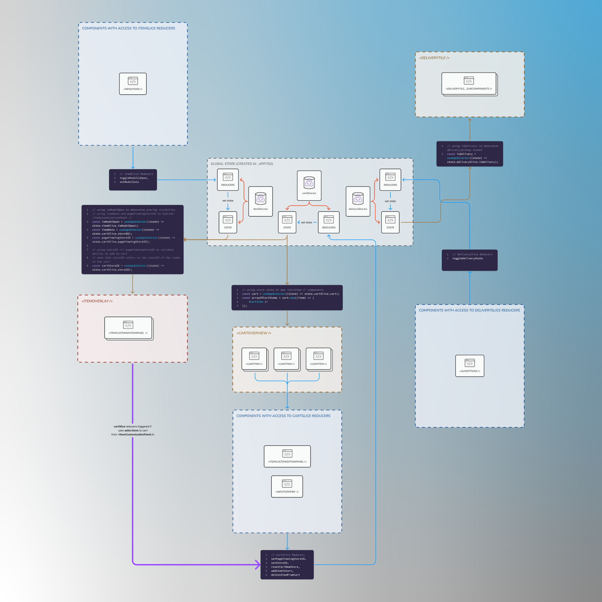

# Doordash Clone, a Rapid Prototype 👯 

👋 Hey there! Please take a look at [this Notion](https://anericzhang.notion.site/DoorDash-Clone-Discoveries-Hurdles-Lessons-A-WIP-f2fc244b5a3441528a1a69376377170f) to gauge at technical findings, hurdles, and lessons I am uncovering while working on this project.

## 🧘 Motivations

I wanted to create a baseline clone of DoorDash's home portal from an authenticated user's perspective. This challenge tested a variety of skillsets including prototyping pixel perfect, data driven, and reusable UI components. 

This challenge is currently undergoing active development as of January 6th 2023, so features including SSR driven merchant pages, search functionality, and checkout will be implemented along the way. Please check [Roadmap](#roadmap) for more information!

Up-to-date builds are hosted on Vercel. Please take a look at the `About` section on this repository to access the build.

# Table of Contents
* [Getting Started](#getting-started)
* [Technology](#technology)
* [Application Architecture](#application-architecture)
* [Roadmap](#roadmap)
    * [Recently Completed](#recently-completed)
    * [In Progress](#in-progress)
    * [Next Up](#next-up)
* [Resources and References](#resources-and-references)
* [Feedback](#feedback)

## Getting Started

Install the dependencies and start the development server

From the project root,
```bash
npm i
npx next
```

Open [http://localhost:3000](http://localhost:3000) with your browser to the application.

You can start editing the page by modifying `pages/index.tsx`. The page auto-updates as you edit the file.

This project uses [`next/font`](https://nextjs.org/docs/basic-features/font-optimization) to automatically optimize and load local fonts.

## Technology
Next.js is used as the React Framework in this rapid prototype. DoorDash requires Server Side Rendering, as the content that hydrates a merchant's page is widely dynamic. 

[styled-components](https://styled-components.com/) is used as the CSS-in-JS framework used to generate dynamic styles based on component props. 

TypeScript is used as the programming language in this application. With a large range of data-dependent components, it is necessary to guard data driven UI components (and their props) with explicit types. 

## Application Architecture

⚠️ Under Construction ⚠️

⚠️ Under Construction ⚠️

State Management

This clone uses Redux-Toolkit to manage state. Several items are put in global store, including the cart list. Check `cartSlice.tsx` to see reducers and `CartOverview.tsx` to see global store consumption. #5



## Roadmap

### Recently Completed
* Created `<Navbar />` component and `<SearchBar />`, `<ShoppingCartButton />` subcomponents. Completed 1/6/23
* Created `<HomeLayout />` layout components, that holds the `<Navbar />` and child elements from the `index.tsx` page. Completed 1/7/23
* Created reusable & data driven `<RestaurantCarousel />` and `<RestaurantCard />` components and their subcomponents. Completed 1/8/23
* Creating and Linking `<RestaurantCard />` [slug] to a new store view page. Completed 1/10/23
* Asset optimization. Images batched to webp format with 40% quality. Proper image caching, eager/lazy loading on qualified assets.
* Created `<HeroComponent />`, `<CartOverview />`, `<CartItem />`, `<InputStepper />`, and wired them. Currently uses temporary data, needs management from global state. Completed 1/14/23
* Establish global state for CartOverview & Store Items. Completed 1/19/23 https://github.com/theericzhang/doordash-clone/pull/10
* Created `<ItemOverlay />`, `<ItemCustomizationPanel />` to complete add-to-cart logic. completed 1/19/23 https://github.com/theericzhang/doordash-clone/pull/10
* Responsive styling for existing layouts & components when viewport width is under 1800px. Begin 1/19/23, Completed 1/26/23 https://github.com/theericzhang/doordash-clone/pull/13
* a11y + accessibilty enhancements, screen reader testing. Begin 1/26/23, Completed 1/29/23 https://github.com/theericzhang/doordash-clone/pull/16
* Add more restaurants and items Begin 1/31/23 Completed 2/1/23 https://github.com/theericzhang/doordash-clone/pull/17
* Button visited effect remove, webkit mobile Begin 1/31/23 Completed 2/1/23 https://github.com/theericzhang/doordash-clone/pull/17

### In Progress
* Notion updates. Begin 1/31/23
* loading state for getServerSideProps
* create API routes data - use fetch instead of instantiating data files directly

### Next Up
* Implement Search functionality. Start with stores, then cuisines and dishes. (backlogged until e-amuse completed)
* Checkout flow. (backlogged until e-amuse completed)
* Garner feedback.

## Resources and References

- [DoorDash Clone - Discoveries, Hurdles, Lessons (A WIP)](https://anericzhang.notion.site/DoorDash-Clone-Discoveries-Hurdles-Lessons-A-WIP-f2fc244b5a3441528a1a69376377170f) - read about my experience thus far building this application!
- [Next.js Documentation](https://nextjs.org/docs) - learn about Next.js features and API.
- [styled-components](https://styled-components.com/) - learn about styled-components with an interactive button component
- [DoorDash Engineering - Improving Web Page Performance at DoorDash through Server Side Rendering with Next.js](https://doordash.engineering/2022/03/29/improving-web-page-performance-at-doordash-throughserver-side-rendering-with-next-js/) - Read about DoorDash's motivation and technical decision to move to Next.js powered SSR 

## Feedback

I'd love to hear from you! Let me know of any feedback you have; it can be pertinent to this project, tech stack, design assets, etc!


| Contact  |                 |
|----------|----------------------------------------------------------------|
| Twitter  | [@anericzhang](http://twitter.com/anericzhang)                 |
| Mastodon | [@anericzhang@hachyderm.io](https://hachyderm.io/@anericzhang) |
| email    | [anericzhang@gmail.com](mailto:anericzhang@gmail.com)          |
